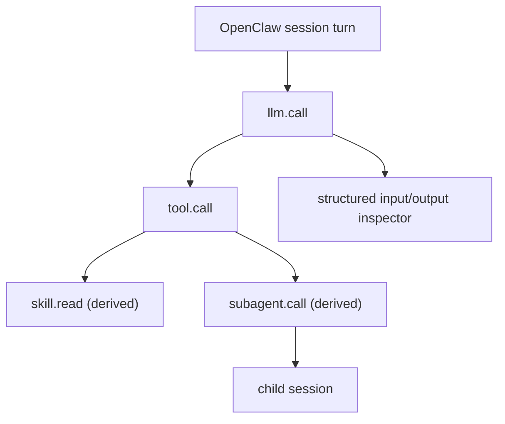

# OpenClaw Audit Plugin

Structured audit logging and local trace visualization for OpenClaw.

This plugin turns OpenClaw runtime activity into a trace-oriented debugging surface:

- session turns as trace roots
- model calls with structured input/output views
- tool calls with input/output artifacts
- skill reads as derived child nodes
- subagent dispatches linked to child sessions

It writes JSONL span/event logs plus large artifacts to the local OpenClaw state directory, then serves a dashboard for exploring trace trees and node-level details.

## At A Glance



## Quick Start

1. Copy this plugin into an OpenClaw plugin directory
2. Load it through OpenClaw
3. Trigger a few real sessions
4. Run the local dashboard:

```bash
npm run trace:ui
```

5. Open:

- `http://127.0.0.1:4318`

## Privacy And Data Handling

This plugin is designed for local inspection.

It can record:

- model inputs
- model outputs
- tool inputs and outputs
- skill content reads
- session and subagent activity

That means the generated logs and artifacts may contain sensitive user data.

Treat these paths as private runtime output:

- `logs/audit-events.log`
- `logs/audit-spans.log`
- `logs/audit-artifacts/`

Do not commit them to a repository or share them without review and redaction.

## Why This Exists

OpenClaw exposes a lot of useful runtime signals, but they are spread across hooks, logs, and session state.

This plugin pulls those signals into one place so you can:

- inspect a full turn as a trace tree
- compare model input vs model output
- see which tools were called and what they returned
- track skill reads separately from prompt-visible skills
- follow parent agent to child subagent dispatches

## What It Includes

- `index.js`: OpenClaw plugin entrypoint
- `server.js`: local trace dashboard server
- `trace-viewer.js`: terminal trace viewer
- `ui/`: dashboard frontend
- `openclaw.plugin.json`: plugin manifest
- `package.json`: standalone scripts for local development

## Installing In OpenClaw

Copy this directory into an OpenClaw workspace or plugin search path, then load it as a local plugin.

Typical shape:

```text
<workspace>/plugins/audit-plugin/
  index.js
  openclaw.plugin.json
  server.js
  trace-viewer.js
  ui/
```

The plugin expects OpenClaw to call `index.js` through the standard plugin mechanism.

## Trace Model

The dashboard uses a practical trace model:

- `session.turn`: turn-level root node
- `llm.call`: model invocation with structured input and output
- `tool.call`: tool invocation with input/output artifacts
- `skill.read`: derived child node under a skill file read
- `subagent.call`: derived child node under `sessions_spawn`

This keeps the tree close to the runtime while still surfacing useful derived behavior.

## Dashboard Views

The dashboard is organized into three panes:

- `Sessions`: session list and filtering
- `Execution Flow`: traces and span trees
- `Inspector`: structured input/output, metadata, and raw JSON

The inspector is intentionally optimized for:

- `llm.call`
- `tool.call`
- `subagent.call`
- `skill.read`

So the most important runtime actions are readable without digging through raw payloads.

## What It Writes

By default, the plugin writes to the OpenClaw state directory:

- `logs/audit-events.log`
- `logs/audit-spans.log`
- `logs/audit-artifacts/`

The base directory is:

- `$OPENCLAW_STATE_DIR` if set
- otherwise `~/.openclaw`

## Running The Dashboard

```bash
npm run trace:ui
```

Optional environment variables:

- `TRACE_UI_PORT`: dashboard port, defaults to `4318`
- `OPENCLAW_STATE_DIR`: override the OpenClaw state directory

Then open:

- `http://127.0.0.1:4318`

Or run directly:

```bash
node server.js
```

## Terminal Trace Viewer

```bash
npm run trace:view -- latest
```

Or pass a specific trace id:

```bash
npm run trace:view -- <trace-id>
```

Or run directly:

```bash
node trace-viewer.js latest
node trace-viewer.js <trace-id>
```

## Publishing Notes

This repository is intended to publish only the plugin code, not local runtime data.

Do **not** publish:

- your `openclaw.json`
- `logs/`
- `audit-artifacts/`
- API keys, tokens, or bot credentials
- real session data
- machine-specific launch agent files

Before publishing, review:

- local absolute paths
- organization-specific names
- copied third-party code or license headers

## Recommended Release Shape

Publish this directory as the unit of reuse:

- `index.js`
- `server.js`
- `trace-viewer.js`
- `ui/`
- `openclaw.plugin.json`
- `package.json`
- `README.md`
- `.gitignore`
- `PUBLISHING.md`

Keep local deployment glue outside the published package:

- user-specific `LaunchAgents`
- private config
- logs and artifacts

## Development

Useful local commands:

```bash
npm run check
npm run trace:ui
npm run trace:view -- latest
```

See also:

- [PUBLISHING.md](./PUBLISHING.md)
- [SECURITY.md](./SECURITY.md)
- [CONTRIBUTING.md](./CONTRIBUTING.md)

## Roadmap Ideas

Possible future improvements:

- screenshot-backed README examples
- export adapters for external tracing backends
- richer trace filtering and search
- compatibility notes across OpenClaw versions

## License

This project is licensed under the MIT License.

If you copied code from OpenClaw itself, preserve the required upstream license notice where needed.
