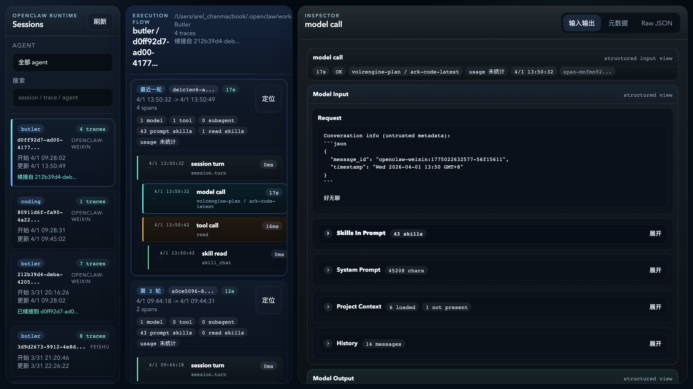
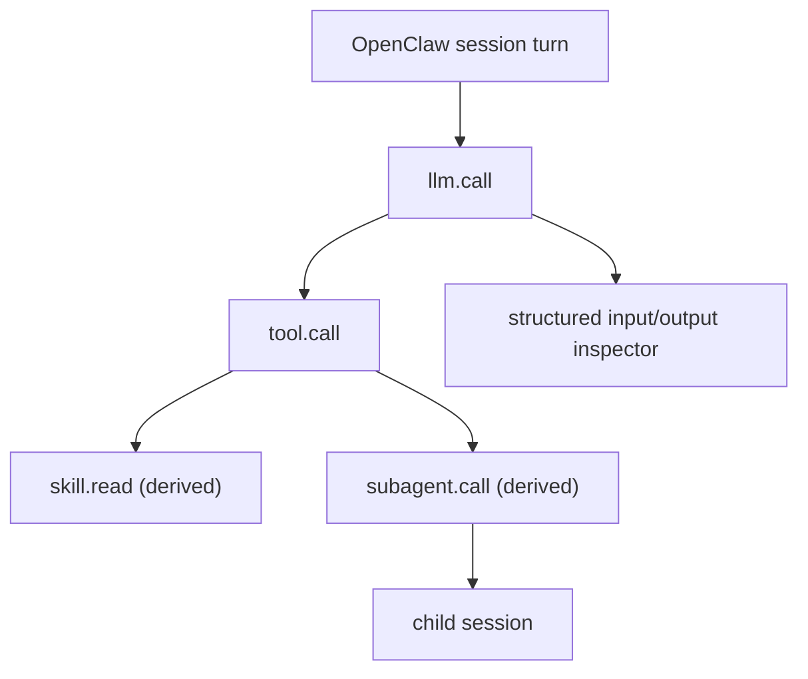

# OpenClaw Audit Plugin

[English](./README.md)

用于 OpenClaw 的结构化审计日志与本地 trace 可视化插件。

这个插件会把 OpenClaw 的运行过程整理成更适合排查和分析的 trace 视图，包括：

- 以 `session.turn` 作为回合根节点
- `llm.call` 的结构化输入输出视图
- `tool.call` 的输入输出与 artifact
- 作为派生节点的 `skill.read`
- 与子会话关联的 `subagent.call`

它会把 span、event 和较大的输入输出内容写入本地 OpenClaw 状态目录，然后提供一个 dashboard 用来查看 trace 树和节点详情。



## 一眼看懂



## 快速开始

1. 把这个插件目录放进 OpenClaw 的插件目录
2. 通过 OpenClaw 加载这个插件
3. 触发几条真实会话
4. 启动本地 dashboard：

```bash
npm run trace:ui
```

5. 打开：

- `http://127.0.0.1:4318`

## 隐私与数据处理

这个插件是为本地排查设计的。

它可能会记录：

- 模型输入
- 模型输出
- 工具调用输入输出
- skill 文件读取内容
- 会话与 subagent 活动

这意味着生成的日志和 artifact 里可能包含敏感数据。

下面这些路径应视为**私有运行时数据**：

- `logs/audit-events.log`
- `logs/audit-spans.log`
- `logs/audit-artifacts/`

不要未经审查和脱敏就把它们提交到仓库或分享出去。

## 为什么做这个

OpenClaw 本身暴露了不少运行时信号，但它们分散在 hook、日志和会话状态里。

这个插件把这些信息拉到一个统一视图里，方便你：

- 以 trace 树方式查看完整回合
- 对比 model input 与 model output
- 查看工具调用及返回结果
- 区分“prompt 里可见的 skills”和“实际读到的 skills”
- 跟踪父 agent 到子 subagent 的派发关系

## 包含内容

- `index.js`：OpenClaw 插件入口
- `server.js`：本地 trace dashboard 服务
- `trace-viewer.js`：终端 trace 查看器
- `ui/`：dashboard 前端
- `openclaw.plugin.json`：插件 manifest
- `package.json`：本地开发脚本

## 如何安装到 OpenClaw

把这个目录复制到 OpenClaw 的插件目录或可扫描的插件路径中，然后通过 OpenClaw 的标准插件机制加载。

典型目录结构：

```text
<workspace>/plugins/audit-plugin/
  index.js
  openclaw.plugin.json
  server.js
  trace-viewer.js
  ui/
```

OpenClaw 会通过标准插件入口调用 `index.js`。

## Trace 模型

dashboard 使用的是一套偏实用的 trace 模型：

- `session.turn`：回合级根节点
- `llm.call`：模型调用，带结构化输入输出
- `tool.call`：工具调用，带输入输出 artifact
- `skill.read`：挂在 skill 文件读取下方的派生子节点
- `subagent.call`：挂在 `sessions_spawn` 下方的派生子节点

这样既能贴近真实运行过程，又能把关键派生行为显式展示出来。

## Dashboard 视图

dashboard 分成三个主要区域：

- `Sessions`：会话列表与筛选
- `Execution Flow`：trace 和 span 树
- `Inspector`：结构化输入输出、元数据、原始 JSON

Inspector 当前重点优化了这些节点的可读性：

- `llm.call`
- `tool.call`
- `subagent.call`
- `skill.read`

所以最重要的运行时动作不需要翻 raw payload 就能看懂。

## 它会写什么

默认情况下，插件会把数据写入 OpenClaw 状态目录：

- `logs/audit-events.log`
- `logs/audit-spans.log`
- `logs/audit-artifacts/`

基础目录来源：

- 如果设置了 `$OPENCLAW_STATE_DIR`，就用它
- 否则默认是 `~/.openclaw`

## 运行 Dashboard

```bash
npm run trace:ui
```

可选环境变量：

- `TRACE_UI_PORT`：dashboard 端口，默认 `4318`
- `OPENCLAW_STATE_DIR`：覆盖 OpenClaw 状态目录

然后打开：

- `http://127.0.0.1:4318`

也可以直接运行：

```bash
node server.js
```

## 终端 Trace Viewer

```bash
npm run trace:view -- latest
```

也可以指定某个 trace id：

```bash
npm run trace:view -- <trace-id>
```

或者直接运行：

```bash
node trace-viewer.js latest
node trace-viewer.js <trace-id>
```

## 发布说明

这个仓库适合发布插件代码本身，不适合发布本地运行数据。

**不要**公开这些内容：

- 你的 `openclaw.json`
- `logs/`
- `audit-artifacts/`
- API key、token、bot 凭证
- 真实会话数据
- 本机专用的 `LaunchAgents`

发布前请重点检查：

- 本地绝对路径
- 组织/团队专属命名
- 是否复制了第三方代码或许可证声明

## 推荐发布形态

建议把这个目录整体作为可复用单元发布：

- `index.js`
- `server.js`
- `trace-viewer.js`
- `ui/`
- `openclaw.plugin.json`
- `package.json`
- `README.md`
- `README.zh-CN.md`
- `.gitignore`
- `PUBLISHING.md`

本地部署相关内容建议保留在仓库外部：

- 用户级 `LaunchAgents`
- 私有配置
- 日志与 artifacts

## 开发

本地常用命令：

```bash
npm run check
npm run trace:ui
npm run trace:view -- latest
```

相关文档：

- [PUBLISHING.md](./PUBLISHING.md)
- [SECURITY.md](./SECURITY.md)
- [CONTRIBUTING.md](./CONTRIBUTING.md)

## 后续可做

未来可以继续补强的方向：

- 基于截图的 README 示例
- 对接外部 tracing backend 的导出适配
- 更强的 trace 筛选和搜索
- 不同 OpenClaw 版本间的兼容性说明

## License

本项目使用 MIT License。

如果你复制了 OpenClaw 上游代码，请按需要保留对应的许可证声明。
